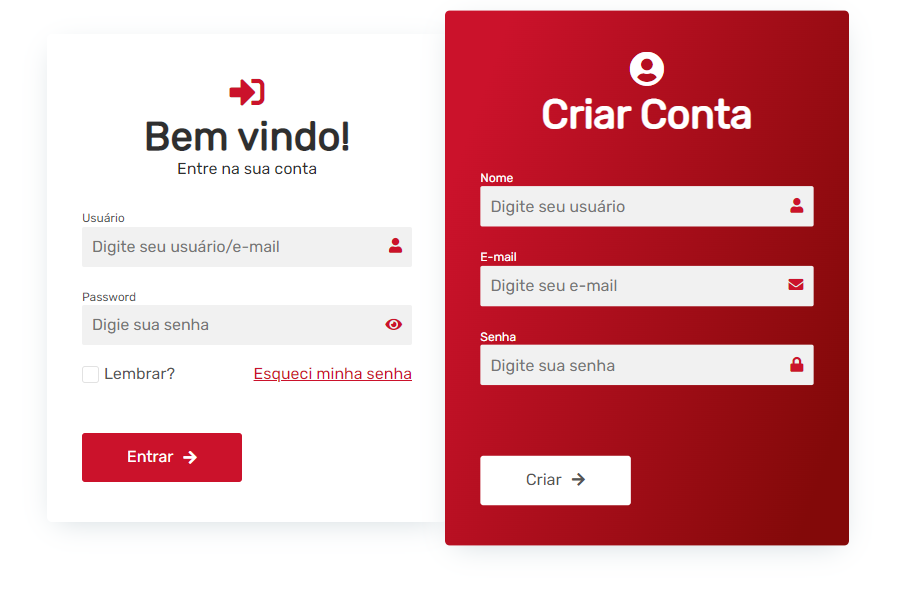

# Projeto de criação de um formulário de login/cadastro

# Sobre o projeto
Este repositório foi criado para colocar em prática os conhecimentos adquiridos nos cursos de HTML e CSS da <b>B7 Web</b> de um projeto <b>Frontend Web</b>.

O objetivo do projeto foi criar um formulário de Login/Cadastro, utilizando tecnologias simples como <b>HTML5 e CSS3</b>, além de englobar os conceitos de: como estruturar um formulário interativo com o usuário, técnicas de CSS3 com containers, como posicionar os elementos com Flexbox e efeitos com CSS.

# Layout do projeto

# Tecnologias utilizadas

* HTML
* CSS 
* Fontawesome
* Google Fonts 

# Autor
<b>Luan Cesar Santos Barbosa</b>

Linkedin: https://www.linkedin.com/in/luancesardev

E-mail: luancesardev@gmail.com
